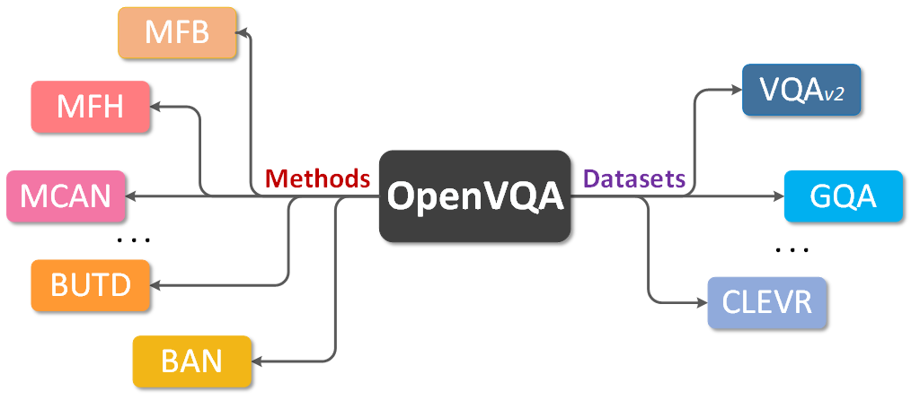

# OpenVQA

<div>
	<a href="https://openvqa.readthedocs.io/en/latest/?badge=latest"></a>
	<a href="https://github.com/MILVLG"></a>
</div>

OpenVQA is a general platform for visual question ansering (VQA) research, with implementing state-of-the-art approaches (e.g., [BUTD](https://arxiv.org/abs/1707.07998), [MFH](https://arxiv.org/abs/1708.03619), [BAN](https://arxiv.org/abs/1805.07932), [MCAN](https://arxiv.org/abs/1906.10770) and [MMNasNet](https://arxiv.org/pdf/2004.12070.pdf)) on different benchmark datasets like [VQA-v2](https://visualqa.org/), [GQA](https://cs.stanford.edu/people/dorarad/gqa/index.html) and [CLEVR](https://cs.stanford.edu/people/jcjohns/clevr/). Supports for more methods and datasets will be updated continuously.


<p align="center">
	
</p>


## Documentation

Getting started and learn more about OpenVQA [here](https://openvqa.readthedocs.io/en/latest/).

## Benchmark and Model Zoo

Supported methods and benchmark datasets are shown in the below table.
Results and models are available in [MODEL ZOO](https://openvqa.readthedocs.io/en/latest/basic/model_zoo.html).

|                                           | [VQA-v2](https://visualqa.org/) | [GQA](https://cs.stanford.edu/people/dorarad/gqa/index.html) | [CLEVR](https://cs.stanford.edu/people/jcjohns/clevr/) |
|:-----------------------------------------:|:-------------------------------:|:------------------------------------------------------------:|:------------------------------------------------------:|
| [BUTD](https://arxiv.org/abs/1707.07998)  | ✓                               |      ✓                                                        |                                                        |
| [MFB](https://arxiv.org/abs/1708.01471v1) | ✓                               |                                                              |                                                        |
| [MFH](https://arxiv.org/abs/1708.03619)   | ✓                               |                                                              |                                                        |
| [BAN](https://arxiv.org/abs/1805.07932)   | ✓                               |       ✓                                                       |                                                        |
| [MCAN](https://arxiv.org/abs/1906.10770)  | ✓                               | ✓                                                            | ✓                                                      |
| [MMNasNet](https://arxiv.org/pdf/2004.12070.pdf)  | ✓                               |                                                             |                                                       |

## News & Updates

#### v0.7.5 (30/12/2019)
- Add supports and pre-trained models for the approaches on CLEVR.

#### v0.7 (29/11/2019)
- Add supports and pre-trained models for the approaches on GQA.
- Add an document to tell developers how to add a new model to OpenVQA.

#### v0.6 (18/09/2019)
- Refactoring the documents and using Sphinx to build the whole documents. 

#### v0.5 (31/07/2019)
- Implement the basic framework for OpenVQA.
- Add supports and pre-trained models for BUTD, MFB, MFH, BAN, MCAN on VQA-v2. 

## License

This project is released under the [Apache 2.0 license](LICENSE).

## Contact

This repo is currently maintained by Zhou Yu ([@yuzcccc](https://github.com/yuzcccc)) and Yuhao Cui ([@cuiyuhao1996](https://github.com/cuiyuhao1996)).

## Citation

If this repository is helpful for your research or you want to refer the provided results in the modelzoo, you could cite the work using the following BibTeX entry:

```
@misc{yu2019openvqa,
  author = {Yu, Zhou and Cui, Yuhao and Shao, Zhenwei and Gao, Pengbing and Yu, Jun},
  title = {OpenVQA},
  howpublished = {\url{https://github.com/MILVLG/openvqa}},
  year = {2019}
}
